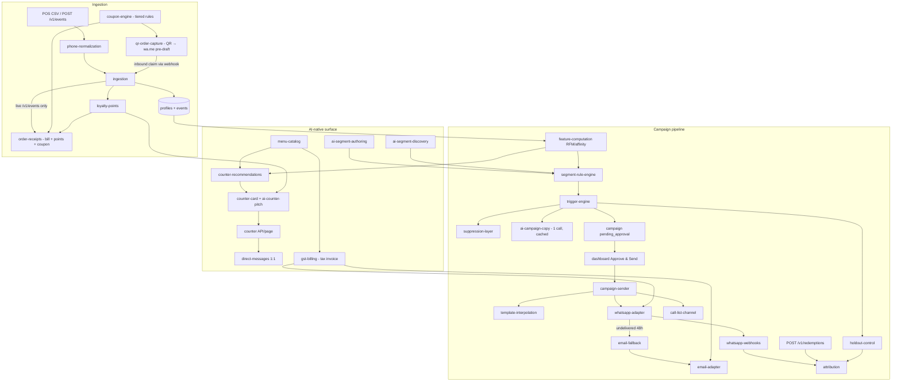

# HPAS Knowledge Graph

A structured map of every feature in this codebase: what it does, which files implement it,
what it depends on, and what depends on it. **Consult this before changing code; update it
after changing code** (see CLAUDE.md).

Node IDs are `kebab-case` and referenced in `depends on` / `used by` lists. Format per node:

> **`node-id`** — one-line purpose. *Files:* implementing files. *Depends on:* upstream nodes. *Used by:* downstream nodes.

---

## 1. System flow (edges at a glance)

---

## 2. Foundation

- **`multi-tenancy`** — Row-level tenancy enforced at the query layer: every business table
  carries `tenant_id`, every repo function requires it, API tenants resolve from credentials
  (never request bodies). Cross-tenant access is a bug by construction.
  *Files:* `packages/db/src/repos.ts`, `packages/db/src/repos-ai.ts`, `apps/api/src/auth.ts`.
  *Used by:* every node below.

- **`shared-types`** — Domain types incl. `TenantConfig` (branding, POS column mapping,
  festivals, brand voice, channels, module toggles, loyalty config).
  *Files:* `packages/types/src/index.ts`.
  *Used by:* everything.

- **`db-layer`** — Postgres client, SQL migrations runner, and the tenant-scoped typed query
  layer (repos). Migrations: `001_init.sql` (core schema), `002_call_list_csv.sql`
  (call-list CSV stored in DB — Vercel-safe), `003_ai_native.sql` (menu, loyalty ledger,
  direct messages, counter-card cache, segments), `004_receipts_coupons_qr.sql` (coupons,
  qr_orders, transactional_messages).
  *Files:* `packages/db/src/client.ts`, `migrate.ts`, `repos.ts`, `repos-ai.ts`,
  `repos-engage.ts`, `packages/db/migrations/*.sql`.
  *Depends on:* `shared-types`. *Used by:* all core/jobs/channels/api nodes.

- **`tenant-onboarding`** — A shop = a config folder, never code. `tenants/_template/`
  documents every field; `tenants/dadus/` is the pilot (config + 186-row seed CSV).
  Seeding is idempotent: tenant row, preferences, standard segments, CSV ingestion,
  loyalty backfill, menu import, feature compute, trigger run.
  *Files:* `apps/worker/src/seed.ts`, `apps/worker/src/tenant-files.ts`,
  `tenants/_template/*`, `tenants/dadus/*`, `scripts/generate-seed-data.mjs`.
  *Depends on:* `ingestion`, `feature-computation`, `loyalty-points`, `menu-catalog`,
  `trigger-engine`, `db-layer`.

- **`auth`** — HMAC session tokens (dashboard login, `DEMO_PASSWORD`) + derived per-tenant
  API keys (POS/ingestion). Demo-shaped like real auth so an IdP swap touches only token
  issue/verify. Vercel Cron endpoints authorized via `CRON_SECRET`.
  *Files:* `apps/api/src/auth.ts`, `apps/api/api/cron/_auth.ts`.
  *Used by:* all API routes, `cron-endpoints`.

## 3. Ingestion & profiles

- **`phone-normalization`** — THE shared normalizer to E.164 (Indian formats); every entry
  point (CSV, streaming, webhooks, opt-outs) must use it. #1 duplicate-profile defense.
  *Files:* `packages/core/src/phone.ts` (+ `phone.test.ts`).
  *Used by:* `ingestion`, `whatsapp-webhooks`, `counter-card`, `direct-messages`.

- **`csv-parsing`** — Dependency-free RFC-4180-tolerant CSV parser for POS exports.
  *Files:* `packages/core/src/csv.ts`. *Used by:* `ingestion`.

- **`ingestion`** — Both paths (CSV upload with per-tenant column mapping + streaming
  `POST /v1/events`) funnel through `ingestNormalizedEvents`: profile upsert + append-only
  events, identical behavior. Earns loyalty points inline. The streaming path (live orders
  only — never CSV backfills) additionally triggers `order-receipts` after ingest.
  *Files:* `packages/core/src/ingestion.ts`, `apps/api/src/routes/ingest.ts`.
  *Depends on:* `phone-normalization`, `csv-parsing`, `loyalty-points`, `db-layer`.
  *Used by:* `tenant-onboarding`, `feature-computation` (post-ingest recompute),
  `order-receipts` (streaming path), `qr-order-capture` (claims ingest through the same path).

- **`qr-order-capture`** — Brings online/aggregator (Swiggy/Zomato) customers into the
  system: one unguessable token + QR per online order (`POST /v1/qr-orders`, API key or
  dashboard). Scanning hits the public `GET /q/:token` redirect → wa.me deep link with the
  token pre-drafted; the customer pressing send fires the inbound webhook, which ingests the
  order as a purchase (points included), claims the token idempotently, and replies with a
  welcome + optional coupon. Printable SVG at `GET /q/:token/qr.svg`. Config:
  `qrCapture.{enabled,messageTemplate}` in tenant config (template must keep `{{token}}`).
  The dashboard's QR desk (/data) lets the shop pick real items from its own `menu-catalog`
  (qty picker computes the amount — not manually editable) instead of free-typing an amount —
  `items` travels with the order and lands on the purchase record once claimed. The public
  `GET /q/:token` claim page asks the customer's name before redirecting into WhatsApp
  (`namePromptPage`), weaving it into the pre-drafted message text in a fixed phrasing
  ("This is {{name}}, adding my order..."); the inbound webhook parses it back out via
  `NAME_FROM_MESSAGE_RE`, falling back to WhatsApp's own `contacts[].profile.name` if the
  customer edited the message — this is deliberately not dependent on the WhatsApp account
  having a display name set, which many don't.
  *Files:* `apps/api/src/routes/qr-orders.ts`, claim handling in
  `packages/channels/src/whatsapp.ts`, repos in `packages/db/src/repos-engage.ts`,
  dashboard picker in `apps/dashboard/app/data/page.tsx`.
  *Depends on:* `ingestion`, `whatsapp-webhooks`, `coupon-engine`, `order-receipts`
  (welcome sender), `phone-normalization`, `db-layer`, `menu-catalog` (dashboard item picker).
  *Used by:* `dashboard-app` (/data QR desk).

## 4. Deterministic campaign brain (`packages/core` — no LLM anywhere here)

- **`feature-computation`** — Precomputed RFM + affinity features written to the `features`
  table nightly and post-ingest. Segmentation only ever reads the table, never computes live.
  Includes festival-buyer detection against *past* festival dates.
  *Files:* `packages/core/src/features.ts`, `packages/jobs/src/compute-features.ts`.
  *Depends on:* `ingestion`, `db-layer`. *Used by:* `segment-rule-engine`,
  `counter-recommendations`, `template-interpolation`, `suppression-layer`.

- **`segment-rule-engine`** — Segment rules are JSON in the DB, compiled to parameterized
  SQL with strictly whitelisted columns/operators; `selectAudience` always prepends
  `tenant_id = $1`. AI-authored rules pass through the same compiler — hallucinated columns
  die at preview.
  *Files:* `packages/core/src/segments.ts`, `apps/api/src/routes/segments.ts`.
  *Depends on:* `feature-computation`, `db-layer`.
  *Used by:* `trigger-engine`, `ai-segment-authoring`, `ai-segment-discovery`, `dashboard-segments`.

- **`suppression-layer`** — Mandatory, no-bypass gate on every enrollment: (1) tenant
  preference per campaign type, (2) global opt-out list, (3) rolling-week frequency cap.
  *Files:* `packages/core/src/suppression.ts`.
  *Depends on:* `db-layer`. *Used by:* `trigger-engine`.

- **`holdout-control`** — Random ~17% of every enrolled audience flagged `is_control`,
  never sent to, tracked identically. Basis of attribution.
  *Files:* `packages/core/src/holdout.ts`.
  *Used by:* `trigger-engine`, `attribution`.

- **`trigger-engine`** — Cron-driven: evaluates every segment → suppression → hold-out →
  enrolls into a `pending_approval` campaign + one injected copy-generation callback
  (keeps core AI-free). Festival campaigns only fire inside the configured pre-festival
  window (seed demo bypass is flagged, demo-only). NOTHING sends from here.
  *Files:* `packages/core/src/triggers.ts`, `packages/jobs/src/evaluate-triggers.ts`,
  `packages/jobs/src/copy-generator.ts` (the core↔AI wiring point).
  *Depends on:* `segment-rule-engine`, `suppression-layer`, `holdout-control`,
  `ai-campaign-copy`. *Used by:* `approval-queue`, `tenant-onboarding`.

- **`approval-queue`** — The send gate: owner reviews/edits (validated template edit),
  approves or rejects. "Approve & Send" sends inline; the 5-minute worker cron
  (`send-campaigns` job) is the safety net for approved-but-unsent.
  *Files:* `apps/api/src/routes/app.ts`, `packages/jobs/src/send-campaigns.ts`,
  `apps/dashboard/app/campaigns/page.tsx`.
  *Depends on:* `trigger-engine`, `campaign-sender`, `auth`.

- **`template-interpolation`** — Deterministic send-time rendering: the AI writes one
  template per campaign; this fills `TEMPLATE_VARIABLES` per profile. No LLM.
  *Files:* `packages/core/src/interpolate.ts`.
  *Depends on:* `feature-computation`. *Used by:* `campaign-sender`, `ai-campaign-copy` (validation).

- **`coupon-engine`** — Deterministic personalized-coupon issuance, no LLM: admin-configured
  tiers (bill amount → percent/flat reward + validity) with a per-customer frequency guard
  (`minDaysBetweenCoupons`); highest matching tier wins. Codes (`DADU-CP-X7K2M9`) are stored
  against profile + phone and deliberately match the campaign redemption-code shape, so they
  redeem through the same two paths: typed back on WhatsApp (inbound webhook) or at the till
  (`POST /v1/redemptions`). Config `coupons.{enabled,tiers,minDaysBetweenCoupons,codePrefix}`
  is editable live via `GET/PUT /v1/app/settings/engagement` (persisted with
  `patchTenantConfig`) or pre-seeded in `config.json`. Also owns the QR-order token
  generator/regex.
  *Files:* `packages/core/src/coupons.ts`, repos in `packages/db/src/repos-engage.ts`,
  redemption in `apps/api/src/routes/redemptions.ts` + `packages/channels/src/whatsapp.ts`,
  settings in `apps/api/src/routes/app.ts`.
  *Depends on:* `shared-types` (coupon config), `db-layer`.
  *Used by:* `order-receipts`, `qr-order-capture`, `whatsapp-webhooks` (redeem),
  `dashboard-app` (/preferences rules editor).

- **`attribution`** — Messaged vs hold-out control per campaign: incremental repeat-purchase
  rate + incremental revenue, plus hard redemptions joined via per-message codes.
  Deterministic SQL + arithmetic.
  *Files:* `packages/core/src/attribution.ts`, `apps/api/src/routes/redemptions.ts`
  (POS code entry), redemption-via-WhatsApp in `whatsapp-webhooks`.
  *Depends on:* `holdout-control`, `campaign-sender`, `db-layer`.
  *Used by:* `dashboard-insights`.

## 5. Channels (`packages/channels`)

- **`channel-interface`** — One `send(channel, tenant, profile, ...)` signature over all adapters.
  *Files:* `packages/channels/src/index.ts`. *Used by:* `campaign-sender`, `email-fallback`.

- **`whatsapp-adapter`** — Meta Cloud API adapter. Models real constraints: pre-approved
  templates only (no approved template = refused send), opt-in store. `WHATSAPP_MODE=stub`
  (default) records instead of calling; `TODO(whatsapp-live)` marks every live-credentials spot.
  POS import counts as opt-in for the pilot.
  *Files:* `packages/channels/src/whatsapp.ts`.
  *Depends on:* `db-layer`. *Used by:* `channel-interface`, `campaign-sender`, `direct-messages`.

- **`whatsapp-webhooks`** — Per-tenant-slug webhook endpoints (Meta verify handshake,
  delivery receipts, inbound replies, STOP opt-outs, redemption codes typed back, coupon
  codes redeemed, QR-order tokens claimed). Every inbound message carries the customer's
  WhatsApp profile name in `contacts[].profile.name` alongside `messages[]` — the inbound
  handler matches it by `wa_id` and merges it into the profile's traits on upsert, so a QR
  claim or any reply captures a name, not just a phone number.
  *Files:* `apps/api/src/routes/webhooks.ts`, handlers in `packages/channels/src/whatsapp.ts`.
  *Depends on:* `phone-normalization`, `coupon-engine`, `db-layer`. *Used by:* `attribution`,
  `email-fallback` (delivery status), `qr-order-capture` (claim entry point).

- **`email-adapter`** — Resend-shaped fallback channel; `EMAIL_MODE=stub` default.
  *Files:* `packages/channels/src/email.ts`. *Used by:* `email-fallback`.

- **`email-fallback`** — WhatsApp undelivered/unread 48h after send + email on file → same
  rendered text by email. Switches the *same* message row's channel so attribution counts
  each customer exactly once.
  *Files:* `packages/channels/src/fallback.ts`, `packages/jobs/src/email-fallback.ts`.
  *Depends on:* `email-adapter`, `whatsapp-webhooks`, `db-layer`.

- **`call-list-channel`** — High-value lapsed customers get a human call instead of a
  broadcast: CSV + per-customer talking points from real history. CSV stored in the DB
  (`campaigns.call_list_csv`, migration 002) — Vercel-safe; downloaded via
  `GET /v1/app/campaigns/:id/call-list.csv`.
  *Files:* `packages/channels/src/call-list.ts`.
  *Used by:* `campaign-sender`, `approval-queue` (download).

- **`campaign-sender`** — Sends an APPROVED campaign: renders from the cached template,
  routes per profile (high-LTV lapsed → call list, else WhatsApp), never touches control rows.
  Called inline by the API on approve and by the worker safety net.
  *Files:* `packages/channels/src/campaign-sender.ts`.
  *Depends on:* `template-interpolation`, `channel-interface`, `whatsapp-adapter`,
  `call-list-channel`, `holdout-control`. *Used by:* `approval-queue`, `send-campaigns` job.

- **`direct-messages`** — 1:1 note from the Counter page (owner → customer). Recorded in
  `direct_messages`, never in campaign messages — attribution and hold-out stay clean.
  *Files:* `packages/channels/src/direct.ts`, route in `apps/api/src/routes/counter.ts`.
  *Depends on:* `whatsapp-adapter`, `phone-normalization`. *Used by:* `counter-card` page/API.

- **`order-receipts`** — Transactional WhatsApp sends triggered by the customer's own
  purchase (so no campaign approval gate; opt-outs still honored): the itemized bill +
  loyalty points earned/balance + a `coupon-engine` coupon when rules match, fired only from
  the streaming ingest path; and the QR-claim welcome (same content, welcome framing —
  always inside Meta's 24h service window since the customer just messaged). Recorded in
  `transactional_messages` — never in campaign messages or `direct_messages`, keeping
  attribution, hold-outs, and the owner's 1:1 history clean. Config
  `receipts.{enabled,showItems,footerNote}`. In `WHATSAPP_MODE=live`, `sendTransactionalWhatsApp`
  sends real free-form text via the Graph API (`POST /{phone_number_id}/messages`, no template
  needed since it's always inside the 24h service window) — the recorded `status` reflects
  whether that live send actually succeeded, not just the opt-out check. A receipt fired from a
  bulk CSV import may fall outside that window; for production at real scale that path should
  move to an approved Meta "utility" template — free-form is fine for a live demo.
  *Files:* `packages/channels/src/receipt.ts`, wiring in `apps/api/src/routes/ingest.ts`.
  *Depends on:* `ingestion`, `loyalty-points`, `coupon-engine`, `db-layer`.
  *Used by:* `qr-order-capture` (welcome).

## 6. AI surface (`packages/ai` — the ONLY LLM call sites; all authoring-time or cached)

- **`ai-provider`** — The single seam to any LLM: `CopyProvider` interface with four narrow
  functions. Anthropic implementation + deterministic mock (no `ANTHROPIC_API_KEY` = fully
  offline demo). Swapping providers touches zero callers.
  *Files:* `packages/ai/src/provider.ts`, `anthropic-provider.ts`, `mock-provider.ts`,
  `index.ts`.
  *Used by:* the four nodes below.

- **`ai-campaign-copy`** — `generateCampaignCopy`: ONE template per campaign, cached on the
  campaign row; send time is plain interpolation. Can name real recently-added menu items.
  *Files:* `packages/ai/src/index.ts`, wired in `packages/jobs/src/copy-generator.ts`.
  *Depends on:* `ai-provider`, `menu-catalog`. *Used by:* `trigger-engine`.

- **`ai-segment-authoring`** — `authorSegmentFromPrompt`: owner's plain words → segment rule
  **as data**; the whitelisted compiler + live audience preview validate before save
  (`POST /v1/app/segments/preview` → `POST /v1/app/segments`).
  *Files:* `packages/ai/src/index.ts`, `apps/api/src/routes/segments.ts`.
  *Depends on:* `ai-provider`, `segment-rule-engine`. *Used by:* `dashboard-segments`.

- **`ai-segment-discovery`** — `discoverSegments`: aggregate PII-free stats → proposed named,
  sized segments; saved only on the owner's tap (`POST /v1/app/segments/discover`).
  *Files:* `packages/ai/src/index.ts`, `apps/api/src/routes/segments.ts`.
  *Depends on:* `ai-provider`, `segment-rule-engine`, `feature-computation`.
  *Used by:* `dashboard-segments`.

- **`ai-counter-pitch`** — `generateCounterPitch`: one cashier line per customer, cached 24h
  per (tenant, profile) — cost scales with counter footfall, not customer count.
  *Files:* `packages/ai/src/index.ts`, cache in `packages/jobs/src/counter-card.ts`.
  *Depends on:* `ai-provider`, `counter-recommendations`. *Used by:* `counter-card`.

## 7. AI-native dashboard modules (per-tenant toggleable)

- **`counter-recommendations`** — Deterministic ranking: customer history + co-purchase
  graph + reorder timing + untried menu items + festival context → 2-3 suggestions. Only
  ever suggests in-stock menu items. No AI in candidates/ranking.
  *Files:* `packages/core/src/recommendations.ts`, co-purchase query in
  `packages/db/src/repos-ai.ts`.
  *Depends on:* `feature-computation`, `menu-catalog`, `db-layer`. *Used by:* `counter-card`.

- **`counter-card`** — Everything a cashier needs on phone lookup: identity, loyalty balance,
  ranked suggestions, pitch line. Dashboard `/loyalty` page (session) and POS-facing
  `GET /v1/counter?phone=` (API key) serve the same card. Award/redeem + 1:1 note from the
  same screen. On a 404 (`"no customer with that number yet"` — surfaced to the dashboard via
  a `status` property the shared `api()` client now attaches to thrown errors), the page shows
  a "new customer" form instead of a bare error: name + optional menu-item picker, posting to
  `POST /v1/app/counter/new-customer`, which creates the profile and (if items were picked)
  records the first purchase through `ingestNormalizedEvents` — the same path CSV/QR use, so
  loyalty points and opt-in behave identically regardless of entry point.
  *Files:* `packages/jobs/src/counter-card.ts`, `apps/api/src/routes/counter.ts`,
  `apps/dashboard/app/loyalty/page.tsx`, `apps/dashboard/lib/api.ts`.
  *Depends on:* `counter-recommendations`, `ai-counter-pitch`, `loyalty-points`,
  `phone-normalization`, `direct-messages`, `auth`, `ingestion`, `menu-catalog` (item picker).

- **`loyalty-points`** — Deterministic points math over an append-only ledger; earn happens
  inside ingestion (both paths) so points never drift from events. Backfilled from history
  at seed. Balance-guarded adjust endpoint (`POST /v1/{app/}loyalty/adjust`).
  *Files:* `packages/core/src/loyalty.ts`, ledger repos in `packages/db/src/repos-ai.ts`.
  *Depends on:* `ingestion`, `shared-types` (loyalty config), `db-layer`.
  *Used by:* `counter-card`, `tenant-onboarding`, `order-receipts` (points earned/balance
  on the bill).

- **`menu-catalog`** — Catalog with prices + stock toggles; one-tap import from sales history
  (cold-start). Constrains recommendations to sellable items; feeds new-item names to copy.
  Each item optionally carries `hsnCode`/`gstRate` (nullable — falls back to the tenant's
  `billingProfile.defaultHsnCode`/`defaultGstRate` at invoice time, see `gst-billing`).
  *Files:* `packages/core/src/menu.ts`, `apps/api/src/routes/menu.ts`,
  `apps/dashboard/app/menu/page.tsx`, repos in `packages/db/src/repos-ai.ts`.
  *Depends on:* `db-layer`. *Used by:* `counter-recommendations`, `ai-campaign-copy`,
  `tenant-onboarding`, `qr-order-capture` (dashboard item picker for QR orders),
  `gst-billing` (per-item tax rate/HSN).

- **`gst-billing`** — Tenant-invoked GST tax invoice generation. The tenant fills in their own
  business/GST details once (`Settings → Billing`, `GET/PUT /v1/app/settings/billing`, stored
  as `tenants.config->billingProfile` — mirrors the `settings/engagement` pattern exactly:
  `patchTenantConfig` shallow-merge, `billingProfileConfig()` default accessor). From the
  `/billing` page, picking items + a phone number and hitting Generate (`POST
  /v1/app/invoices`) looks up/creates the customer profile, resolves each line's GST
  rate/HSN (menu item → tenant default → 0) via `computeInvoiceLines`
  (`packages/core/src/gst.ts`), and atomically claims the next sequential per-tenant invoice
  number (`invoice_counters` table, one UPDATE...RETURNING, no racy `COUNT(*)+1`). The
  invoice snapshots its line items/tax breakup at creation time — later menu-price or
  GST-rate edits never change a past invoice. Delivered three ways: a public printable HTML
  page at `GET /i/:token` (same unguessable-token-is-the-credential pattern as the QR claim
  page, mounted in `app.ts` right alongside `/q`), a WhatsApp message via
  `sendTransactionalWhatsApp` (kind `"invoice"`) with a link, and — when the profile has an
  email trait — `sendInvoiceEmail` (a generic Resend send, distinct from the
  campaign-fallback-only `sendViaEmail`).
  **Deliberate scope limits** (see the migration's header comment for the full list):
  intra-state supply only (CGST+SGST split, no IGST/place-of-supply — this product has no
  notion of a customer's billing state, being a physical-counter/QR-pickup flow, not shipped
  e-commerce); no GSTN e-invoice IRN/GSP integration (this generates a valid-looking invoice
  document, not a government-registered e-invoice); continuous invoice numbering, no
  financial-year reset.
  *Files:* `packages/core/src/gst.ts`, `packages/db/src/repos-billing.ts`,
  `apps/api/src/routes/billing.ts`, `apps/dashboard/app/settings/billing/page.tsx`,
  `apps/dashboard/app/billing/page.tsx`, migration `005_gst_billing.sql`.
  *Depends on:* `menu-catalog` (tax rate/HSN per item), `phone-normalization`,
  `whatsapp-adapter`, `email-adapter`, `db-layer`.
  *Not wired in yet (deliberately out of v1 scope):* auto-generating an invoice from the
  Counter's `/counter/new-customer` flow or the QR-claim flow — this is a standalone,
  tenant-invoked action for now, matching "filled by tenant himself."

## 8. Apps & operations

- **`api-app`** — Express app, deploy-target-neutral: `src/app.ts` never calls `listen()`;
  `src/index.ts` runs persistent (:4000), `api/index.ts` exports the same app for Vercel
  serverless. Routes: auth/login, ingest, redemptions (campaign codes + coupons), webhooks,
  app (insights, campaigns, attribution, preferences, settings, settings/engagement),
  segments, counter, menu, qr-orders, plus the public unauthenticated `GET /q/:token`
  claim redirect + `/q/:token/qr.svg` (the unguessable token is the credential).
  *Files:* `apps/api/src/app.ts`, `index.ts`, `apps/api/api-src/index.ts` + `cron/*.ts`,
  `apps/api/src/routes/*`, `apps/api/vercel.json`.
  *Depends on:* `auth`, all route-backing nodes.

  **⚠️ Deploy gotcha:** `apps/api/api/*.js` (the actual Vercel serverless functions — `index.js`,
  `cron/nightly.js`, `cron/maintenance.js`) are esbuild-bundled output, **committed to git**, and
  Vercel's configured Install Command (`pnpm install && pnpm build:packages`) does **not**
  regenerate them — that only rebuilds `packages/*/dist`. Editing `apps/api/src/**` or any
  `packages/*/src` file and deploying without an explicit rebuild silently ships a **stale
  bundle** (no error, no warning — it just runs old code). Before every deploy of `hpas-api`
  after any source change: `pnpm build:packages && (cd apps/api && node
  scripts/build-vercel-functions.mjs)`, confirm the new code landed (e.g. `grep` the target
  function/string in `apps/api/api/index.js`), *then* `vercel deploy --prod`. This bit an entire
  debugging session (2026-07-13/14) where a real bug fix in `whatsapp.ts` appeared to keep
  failing across multiple "successful" redeploys — it was never actually live.

- **`worker-app`** — Persistent `node-cron` scheduler (persistent-host deploys only) + CLIs:
  `run-job` (any of the 4 jobs by name), `seed`, `smoke`.
  *Files:* `apps/worker/src/index.ts`, `run-job.ts`, `seed.ts`, `smoke.ts`, `tenant-files.ts`.
  *Depends on:* `scheduled-jobs`, `tenant-onboarding`.

- **`scheduled-jobs`** — The named `JOBS` registry shared by worker cron AND Vercel Cron:
  `compute-features` (nightly + post-ingest), `evaluate-triggers` (daily),
  `send-campaigns` (5-min safety net), `email-fallback` (hourly).
  *Files:* `packages/jobs/src/index.ts` + per-job files.
  *Depends on:* `feature-computation`, `trigger-engine`, `campaign-sender`, `email-fallback`.
  *Used by:* `worker-app`, `cron-endpoints`.

- **`cron-endpoints`** — Vercel Cron–triggered HTTP handlers running the same job registry;
  authorized by `CRON_SECRET`.
  *Files:* `apps/api/api/cron/nightly.ts`, `maintenance.ts`, `_auth.ts`.
  *Depends on:* `scheduled-jobs`, `auth`.

- **`dashboard-app`** — Next.js shop-owner app (:3000), tenant-themed. Pages: `/` +
  `/insights` (customer picture + impact ← `attribution`), `/campaigns` (approval queue),
  `/segments` (standard + AI authoring/discovery), `/loyalty` (Counter), `/menu`,
  `/data` (uploads + online-order QR desk ← `qr-order-capture`), `/preferences` (toggles +
  frequency cap + receipt/coupon rules ← `coupon-engine`, `order-receipts`), `/settings`
  (WhatsApp status, branding, API key).
  *Files:* `apps/dashboard/app/*/page.tsx`, `components/AppShell.tsx`, `lib/api.ts`.
  *Depends on:* `api-app` (via `lib/api.ts`), `auth`.

- **`smoke-test`** — End-to-end test on a scratch tenant (proves second-tenant onboarding
  runs on zero new code): seed → ingest → features → triggers (suppression + hold-out) →
  cached AI copy → approve → send → personalized message rows with control group.
  *Files:* `apps/worker/src/smoke.ts`. *Depends on:* nearly everything (it is the integration proof).

---

## 9. Maintenance protocol

When code changes, keep this file truthful:

1. **New feature** → add a node (purpose, files, depends on, used by) in the right section
   and wire it into the Mermaid diagram if it's on a main flow.
2. **Changed feature** → update its one-liner, file list, and edges; check every node that
   lists it under *Used by* / *Depends on*.
3. **Removed feature** → delete the node AND remove it from every other node's edge lists
   and the diagram.
4. **New endpoint / job / migration / tenant-config field** → these are feature surface:
   record them on the owning node.
