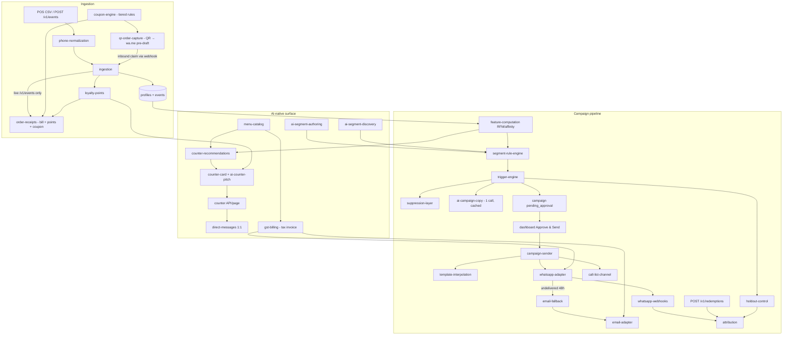

# HPAS Knowledge Graph

A structured map of every feature in this codebase: what it does, which files implement it,
what it depends on, and what depends on it. **Consult this before changing code; update it
after changing code** (see CLAUDE.md).

Node IDs are `kebab-case` and referenced in `depends on` / `used by` lists. Format per node:

> **`node-id`** — one-line purpose. *Files:* implementing files. *Depends on:* upstream nodes. *Used by:* downstream nodes.

---

## 1. System flow (edges at a glance)

---

## 2. Foundation

- **`multi-tenancy`** — Row-level tenancy enforced at the query layer: every business table
  carries `tenant_id`, every repo function requires it, API tenants resolve from credentials
  (never request bodies). Cross-tenant access is a bug by construction.
  *Files:* `packages/db/src/repos.ts`, `packages/db/src/repos-ai.ts`, `apps/api/src/auth.ts`.
  *Used by:* every node below.

- **`shared-types`** — Domain types incl. `TenantConfig` (branding, POS column mapping,
  festivals, brand voice, channels, module toggles, loyalty config).
  *Files:* `packages/types/src/index.ts`.
  *Used by:* everything.

- **`db-layer`** — Postgres client, SQL migrations runner, and the tenant-scoped typed query
  layer (repos). Migrations: `001_init.sql` (core schema), `002_call_list_csv.sql`
  (call-list CSV stored in DB — Vercel-safe), `003_ai_native.sql` (menu, loyalty ledger,
  direct messages, counter-card cache, segments), `004_receipts_coupons_qr.sql` (coupons,
  qr_orders, transactional_messages).
  *Files:* `packages/db/src/client.ts`, `migrate.ts`, `repos.ts`, `repos-ai.ts`,
  `repos-engage.ts`, `packages/db/migrations/*.sql`.
  *Depends on:* `shared-types`. *Used by:* all core/jobs/channels/api nodes.

- **`tenant-onboarding`** — A shop = a config folder, never code. `tenants/_template/`
  documents every field; `tenants/dadus/` is the pilot (config + 186-row seed CSV).
  Seeding is idempotent: tenant row, preferences, standard segments, CSV ingestion,
  loyalty backfill, menu import, feature compute, trigger run.
  *Files:* `apps/worker/src/seed.ts`, `apps/worker/src/tenant-files.ts`,
  `tenants/_template/*`, `tenants/dadus/*`, `scripts/generate-seed-data.mjs`.
  *Depends on:* `ingestion`, `feature-computation`, `loyalty-points`, `menu-catalog`,
  `trigger-engine`, `db-layer`.

- **`auth`** — HMAC session tokens (dashboard login, `DEMO_PASSWORD`) + derived per-tenant
  API keys (POS/ingestion). Demo-shaped like real auth so an IdP swap touches only token
  issue/verify. Vercel Cron endpoints authorized via `CRON_SECRET`.
  *Files:* `apps/api/src/auth.ts`, `apps/api/api/cron/_auth.ts`.
  *Used by:* all API routes, `cron-endpoints`.

## 3. Ingestion & profiles

- **`phone-normalization`** — THE shared normalizer to E.164 (Indian formats); every entry
  point (CSV, streaming, webhooks, opt-outs) must use it. #1 duplicate-profile defense.
  *Files:* `packages/core/src/phone.ts` (+ `phone.test.ts`).
  *Used by:* `ingestion`, `whatsapp-webhooks`, `counter-card`, `direct-messages`.

- **`csv-parsing`** — Dependency-free RFC-4180-tolerant CSV parser for POS exports.
  *Files:* `packages/core/src/csv.ts`. *Used by:* `ingestion`.

- **`ingestion`** — Both paths (CSV upload with per-tenant column mapping + streaming
  `POST /v1/events`) funnel through `ingestNormalizedEvents`: profile upsert + append-only
  events, identical behavior. Earns loyalty points inline. The streaming path (live orders
  only — never CSV backfills) additionally triggers `order-receipts` after ingest.
  *Files:* `packages/core/src/ingestion.ts`, `apps/api/src/routes/ingest.ts`.
  *Depends on:* `phone-normalization`, `csv-parsing`, `loyalty-points`, `db-layer`.
  *Used by:* `tenant-onboarding`, `feature-computation` (post-ingest recompute),
  `order-receipts` (streaming path), `qr-order-capture` (claims ingest through the same path).

- **`qr-order-capture`** — Brings online/aggregator (Swiggy/Zomato) customers into the
  system: one unguessable token + QR per online order (`POST /v1/qr-orders`, API key or
  dashboard). Scanning hits the public `GET /q/:token` redirect → wa.me deep link with the
  token pre-drafted; the customer pressing send fires the inbound webhook, which ingests the
  order as a purchase (points included), claims the token idempotently, and replies with a
  welcome + optional coupon. Printable SVG at `GET /q/:token/qr.svg`. Config:
  `qrCapture.{enabled,messageTemplate}` in tenant config (template must keep `{{token}}`).
  The dashboard's QR desk (/data) lets the shop pick real items from its own `menu-catalog`
  (qty picker computes the amount — not manually editable) instead of free-typing an amount —
  `items` travels with the order and lands on the purchase record once claimed. The public
  `GET /q/:token` claim page asks the customer's name before redirecting into WhatsApp
  (`namePromptPage`), weaving it into the pre-drafted message text in a fixed phrasing
  ("This is {{name}}, adding my order..."); the inbound webhook parses it back out via
  `NAME_FROM_MESSAGE_RE`, falling back to WhatsApp's own `contacts[].profile.name` if the
  customer edited the message — this is deliberately not dependent on the WhatsApp account
  having a display name set, which many don't.
  *Files:* `apps/api/src/routes/qr-orders.ts`, claim handling in
  `packages/channels/src/whatsapp.ts`, repos in `packages/db/src/repos-engage.ts`,
  dashboard picker in `apps/dashboard/app/data/page.tsx`.
  *Depends on:* `ingestion`, `whatsapp-webhooks`, `coupon-engine`, `order-receipts`
  (welcome sender), `phone-normalization`, `db-layer`, `menu-catalog` (dashboard item picker).
  *Used by:* `dashboard-app` (/data QR desk).

## 4. Deterministic campaign brain (`packages/core` — no LLM anywhere here)

- **`feature-computation`** — Precomputed RFM + affinity features written to the `features`
  table nightly and post-ingest. Segmentation only ever reads the table, never computes live.
  Includes festival-buyer detection against *past* festival dates.
  *Files:* `packages/core/src/features.ts`, `packages/jobs/src/compute-features.ts`.
  *Depends on:* `ingestion`, `db-layer`. *Used by:* `segment-rule-engine`,
  `counter-recommendations`, `template-interpolation`, `suppression-layer`.

- **`segment-rule-engine`** — Segment rules are JSON in the DB, compiled to parameterized
  SQL with strictly whitelisted columns/operators; `selectAudience` always prepends
  `tenant_id = $1`. AI-authored rules pass through the same compiler — hallucinated columns
  die at preview.
  *Files:* `packages/core/src/segments.ts`, `apps/api/src/routes/segments.ts`.
  *Depends on:* `feature-computation`, `db-layer`.
  *Used by:* `trigger-engine`, `ai-segment-authoring`, `ai-segment-discovery`, `dashboard-segments`.

- **`suppression-layer`** — Mandatory, no-bypass gate on every enrollment: (1) tenant
  preference per campaign type, (2) global opt-out list, (3) rolling-week frequency cap.
  *Files:* `packages/core/src/suppression.ts`.
  *Depends on:* `db-layer`. *Used by:* `trigger-engine`.

- **`holdout-control`** — Random ~17% of every enrolled audience flagged `is_control`,
  never sent to, tracked identically. Basis of attribution.
  *Files:* `packages/core/src/holdout.ts`.
  *Used by:* `trigger-engine`, `attribution`.

- **`trigger-engine`** — Cron-driven: evaluates every segment → suppression → hold-out →
  enrolls into a `pending_approval` campaign + one injected copy-generation callback
  (keeps core AI-free). Festival campaigns only fire inside the configured pre-festival
  window (seed demo bypass is flagged, demo-only). NOTHING sends from here.
  *Files:* `packages/core/src/triggers.ts`, `packages/jobs/src/evaluate-triggers.ts`,
  `packages/jobs/src/copy-generator.ts` (the core↔AI wiring point).
  *Depends on:* `segment-rule-engine`, `suppression-layer`, `holdout-control`,
  `ai-campaign-copy`. *Used by:* `approval-queue`, `tenant-onboarding`.

- **`approval-queue`** — The send gate: owner reviews/edits (validated template edit),
  approves or rejects. "Approve & Send" sends inline; the 5-minute worker cron
  (`send-campaigns` job) is the safety net for approved-but-unsent.
  *Files:* `apps/api/src/routes/app.ts`, `packages/jobs/src/send-campaigns.ts`,
  `apps/dashboard/app/campaigns/page.tsx`.
  *Depends on:* `trigger-engine`, `campaign-sender`, `auth`.

- **`template-interpolation`** — Deterministic send-time rendering: the AI writes one
  template per campaign; this fills `TEMPLATE_VARIABLES` per profile. No LLM.
  *Files:* `packages/core/src/interpolate.ts`.
  *Depends on:* `feature-computation`. *Used by:* `campaign-sender`, `ai-campaign-copy` (validation).

- **`coupon-engine`** — Deterministic personalized-coupon issuance, no LLM: admin-configured
  tiers (bill amount → percent/flat reward + validity) with a per-customer frequency guard
  (`minDaysBetweenCoupons`); highest matching tier wins. Codes (`DADU-CP-X7K2M9`) are stored
  against profile + phone and deliberately match the campaign redemption-code shape, so they
  redeem through the same two paths: typed back on WhatsApp (inbound webhook) or at the till
  (`POST /v1/redemptions`). Config `coupons.{enabled,tiers,minDaysBetweenCoupons,codePrefix}`
  is editable live via `GET/PUT /v1/app/settings/engagement` (persisted with
  `patchTenantConfig`) or pre-seeded in `config.json`. Also owns the QR-order token
  generator/regex.
  *Files:* `packages/core/src/coupons.ts`, repos in `packages/db/src/repos-engage.ts`,
  redemption in `apps/api/src/routes/redemptions.ts` + `packages/channels/src/whatsapp.ts`,
  settings in `apps/api/src/routes/app.ts`.
  *Depends on:* `shared-types` (coupon config), `db-layer`.
  *Used by:* `order-receipts`, `qr-order-capture`, `whatsapp-webhooks` (redeem),
  `dashboard-app` (/preferences rules editor).

- **`attribution`** — Messaged vs hold-out control per campaign: incremental repeat-purchase
  rate + incremental revenue, plus hard redemptions joined via per-message codes.
  Deterministic SQL + arithmetic.
  *Files:* `packages/core/src/attribution.ts`, `apps/api/src/routes/redemptions.ts`
  (POS code entry), redemption-via-WhatsApp in `whatsapp-webhooks`.
  *Depends on:* `holdout-control`, `campaign-sender`, `db-layer`.
  *Used by:* `dashboard-insights`.

## 5. Channels (`packages/channels`)

- **`channel-interface`** — One `send(channel, tenant, profile, ...)` signature over all adapters.
  *Files:* `packages/channels/src/index.ts`. *Used by:* `campaign-sender`, `email-fallback`.

- **`whatsapp-adapter`** — Meta Cloud API adapter. Models real constraints: pre-approved
  templates only (no approved template = refused send), opt-in store. `WHATSAPP_MODE=stub`
  (default) records instead of calling; `TODO(whatsapp-live)` marks every live-credentials spot.
  POS import counts as opt-in for the pilot.
  *Files:* `packages/channels/src/whatsapp.ts`.
  *Depends on:* `db-layer`. *Used by:* `channel-interface`, `campaign-sender`, `direct-messages`.

- **`whatsapp-webhooks`** — Per-tenant-slug webhook endpoints (Meta verify handshake,
  delivery receipts, inbound replies, STOP opt-outs, redemption codes typed back, coupon
  codes redeemed, QR-order tokens claimed). Every inbound message carries the customer's
  WhatsApp profile name in `contacts[].profile.name` alongside `messages[]` — the inbound
  handler matches it by `wa_id` and merges it into the profile's traits on upsert, so a QR
  claim or any reply captures a name, not just a phone number.
  *Files:* `apps/api/src/routes/webhooks.ts`, handlers in `packages/channels/src/whatsapp.ts`.
  *Depends on:* `phone-normalization`, `coupon-engine`, `db-layer`. *Used by:* `attribution`,
  `email-fallback` (delivery status), `qr-order-capture` (claim entry point).

- **`email-adapter`** — Resend-shaped fallback channel; `EMAIL_MODE=stub` default.
  *Files:* `packages/channels/src/email.ts`. *Used by:* `email-fallback`.

- **`email-fallback`** — WhatsApp undelivered/unread 48h after send + email on file → same
  rendered text by email. Switches the *same* message row's channel so attribution counts
  each customer exactly once.
  *Files:* `packages/channels/src/fallback.ts`, `packages/jobs/src/email-fallback.ts`.
  *Depends on:* `email-adapter`, `whatsapp-webhooks`, `db-layer`.

- **`call-list-channel`** — High-value lapsed customers get a human call instead of a
  broadcast: CSV + per-customer talking points from real history. CSV stored in the DB
  (`campaigns.call_list_csv`, migration 002) — Vercel-safe; downloaded via
  `GET /v1/app/campaigns/:id/call-list.csv`.
  *Files:* `packages/channels/src/call-list.ts`.
  *Used by:* `campaign-sender`, `approval-queue` (download).

- **`campaign-sender`** — Sends an APPROVED campaign: renders from the cached template,
  routes per profile (high-LTV lapsed → call list, else WhatsApp), never touches control rows.
  Called inline by the API on approve and by the worker safety net.
  *Files:* `packages/channels/src/campaign-sender.ts`.
  *Depends on:* `template-interpolation`, `channel-interface`, `whatsapp-adapter`,
  `call-list-channel`, `holdout-control`. *Used by:* `approval-queue`, `send-campaigns` job.

- **`direct-messages`** — 1:1 note from the counter card on Billing (owner → customer). Recorded in
  `direct_messages`, never in campaign messages — attribution and hold-out stay clean.
  *Files:* `packages/channels/src/direct.ts`, route in `apps/api/src/routes/counter.ts`.
  *Depends on:* `whatsapp-adapter`, `phone-normalization`. *Used by:* `counter-card` page/API.

- **`order-receipts`** — Transactional WhatsApp sends triggered by the customer's own
  purchase (so no campaign approval gate; opt-outs still honored): the itemized bill +
  loyalty points earned/balance + a `coupon-engine` coupon when rules match, fired only from
  the streaming ingest path; and the QR-claim welcome (same content, welcome framing —
  always inside Meta's 24h service window since the customer just messaged). Recorded in
  `transactional_messages` — never in campaign messages or `direct_messages`, keeping
  attribution, hold-outs, and the owner's 1:1 history clean. Config
  `receipts.{enabled,showItems,footerNote}`. In `WHATSAPP_MODE=live`, `sendTransactionalWhatsApp`
  sends real free-form text via the Graph API (`POST /{phone_number_id}/messages`, no template
  needed since it's always inside the 24h service window) — the recorded `status` reflects
  whether that live send actually succeeded, not just the opt-out check. A receipt fired from a
  bulk CSV import may fall outside that window; for production at real scale that path should
  move to an approved Meta "utility" template — free-form is fine for a live demo.
  *Files:* `packages/channels/src/receipt.ts`, wiring in `apps/api/src/routes/ingest.ts`.
  *Depends on:* `ingestion`, `loyalty-points`, `coupon-engine`, `db-layer`.
  *Used by:* `qr-order-capture` (welcome).

## 6. AI surface (`packages/ai` — the ONLY LLM call sites; all authoring-time or cached)

- **`ai-provider`** — The single seam to any LLM: `CopyProvider` interface with four narrow
  functions. Anthropic implementation + deterministic mock (no `ANTHROPIC_API_KEY` = fully
  offline demo). Swapping providers touches zero callers.
  *Files:* `packages/ai/src/provider.ts`, `anthropic-provider.ts`, `mock-provider.ts`,
  `index.ts`.
  *Used by:* the four nodes below.

- **`ai-campaign-copy`** — `generateCampaignCopy`: ONE template per campaign, cached on the
  campaign row; send time is plain interpolation. Can name real recently-added menu items.
  *Files:* `packages/ai/src/index.ts`, wired in `packages/jobs/src/copy-generator.ts`.
  *Depends on:* `ai-provider`, `menu-catalog`. *Used by:* `trigger-engine`.

- **`ai-segment-authoring`** — `authorSegmentFromPrompt`: owner's plain words → segment rule
  **as data**; the whitelisted compiler + live audience preview validate before save
  (`POST /v1/app/segments/preview` → `POST /v1/app/segments`).
  *Files:* `packages/ai/src/index.ts`, `apps/api/src/routes/segments.ts`.
  *Depends on:* `ai-provider`, `segment-rule-engine`. *Used by:* `dashboard-segments`.

- **`ai-segment-discovery`** — `discoverSegments`: aggregate PII-free stats → proposed named,
  sized segments; saved only on the owner's tap (`POST /v1/app/segments/discover`).
  *Files:* `packages/ai/src/index.ts`, `apps/api/src/routes/segments.ts`.
  *Depends on:* `ai-provider`, `segment-rule-engine`, `feature-computation`.
  *Used by:* `dashboard-segments`.

- **`ai-counter-pitch`** — `generateCounterPitch`: one cashier line per customer, cached 24h
  per (tenant, profile) — cost scales with counter footfall, not customer count.
  *Files:* `packages/ai/src/index.ts`, cache in `packages/jobs/src/counter-card.ts`.
  *Depends on:* `ai-provider`, `counter-recommendations`. *Used by:* `counter-card`.

## 7. AI-native dashboard modules (per-tenant toggleable)

- **`counter-recommendations`** — Deterministic ranking: customer history + co-purchase
  graph + reorder timing + untried menu items + festival context → 2-3 suggestions. Only
  ever suggests in-stock menu items. No AI in candidates/ranking.
  *Files:* `packages/core/src/recommendations.ts`, co-purchase query in
  `packages/db/src/repos-ai.ts`.
  *Depends on:* `feature-computation`, `menu-catalog`, `db-layer`. *Used by:* `counter-card`.

- **`counter-card`** — Everything a cashier needs on phone lookup: identity, loyalty balance,
  ranked suggestions, pitch line. POS-facing `GET /v1/counter?phone=` (API key) and the
  dashboard's `GET /counter?phone=` (session) serve the same card. There is no standalone
  "Counter" dashboard page/nav link anymore — the lookup is folded directly into **Billing**
  (`apps/dashboard/app/billing/page.tsx`): the existing invoice-form phone field triggers a
  lookup on blur (so the tenant never types the number twice), and if a match is found the
  page shows the customer card, suggestions/pitch, points award/redeem, and a personal
  WhatsApp note inline, right above the item picker. On a 404 (`"no customer with that number
  yet"` — surfaced via a `status` property the shared `api()` client attaches to thrown
  errors) Billing shows a "new customer" notice instead — normally nothing further is needed
  since generating the invoice itself creates the profile (`upsertProfile` +
  `ingestNormalizedEvents` in `apps/api/src/routes/billing.ts`), but a "add them now without a
  bill" button is also offered, posting to `POST /v1/app/counter/new-customer` for the
  no-purchase enrollment case (same endpoint the old Counter page used).
  *Files:* `packages/jobs/src/counter-card.ts`, `apps/api/src/routes/counter.ts`,
  `apps/dashboard/app/billing/page.tsx`, `apps/dashboard/lib/api.ts`.
  *Depends on:* `counter-recommendations`, `ai-counter-pitch`, `loyalty-points`,
  `phone-normalization`, `direct-messages`, `auth`, `ingestion`, `menu-catalog` (item picker),
  `gst-billing`. *Used by:* `gst-billing` (same page, same phone field).

- **`loyalty-points`** — Deterministic points math over an append-only ledger; earn happens
  inside ingestion (both paths) so points never drift from events. Backfilled from history
  at seed. Balance-guarded adjust endpoint (`POST /v1/{app/}loyalty/adjust`).
  *Files:* `packages/core/src/loyalty.ts`, ledger repos in `packages/db/src/repos-ai.ts`.
  *Depends on:* `ingestion`, `shared-types` (loyalty config), `db-layer`.
  *Used by:* `counter-card`, `tenant-onboarding`, `order-receipts` (points earned/balance
  on the bill).

- **`menu-catalog`** — Catalog with prices + stock toggles; one-tap import from sales history
  (cold-start). Constrains recommendations to sellable items; feeds new-item names to copy.
  Each item optionally carries `hsnCode`/`gstRate` (nullable — falls back to the tenant's
  `billingProfile.defaultHsnCode`/`defaultGstRate` at invoice time, see `gst-billing`).
  Reachable from the dashboard as Pricing's "Master Data" (`/menu`, same route, just
  relabeled/relocated in nav — see `dashboard-app`). `GET /menu/export.csv` exports every
  item joined with its current `ai-pricing` recommendation (blank columns if none yet);
  `POST /menu/import` (multipart, `multer` memory storage same as `ingest.ts`'s
  `POST /uploads`) bulk-upserts from a CSV via the existing dependency-free `parseCsv`
  (`packages/core/src/csv.ts`) and `upsertMenuItem`. `PATCH /menu/:id` is a general field
  edit (name/category/price/gstRate/hsnCode/businessUnitIds/tags) — used for inline edits on
  Master Data, distinct from the narrower `PATCH /menu/:id/availability`.
  **Item photos**: `image_url` column (migration `011_menu_item_images.sql`) stores a data
  URI — small shop catalogs, no external object storage needed. `POST /menu/:id/image`
  (multipart, 800KB limit) uploads/replaces; `DELETE /menu/:id/image` clears it.
  **Business unit tags**: `business_unit_ids` JSONB column (migration
  `010_business_units.sql`) — which branches (see `business-units`) sell this item; empty
  means every branch. `GET /menu?businessUnitId=` filters to items tagged to that branch (or
  untagged) and, when given, also returns each item's `branchPrice` (see `business-units`'
  per-branch price override). **Master Data is reachable from both areas** (see
  `dashboard-app`) — Business Units and item↔branch association are a single tenant-wide
  concern, never area-specific, so a Personalization-only tenant can add branches and tag
  items exactly the same as a Pricing tenant.
  **Descriptive tags**: separate `tags` JSONB column (pre-existing from
  `003_ai_native.sql`, wired into the dashboard this batch) — free-text labels a tenant may
  or may not bother with, purely cosmetic (shown as badges, no effect on recommendations,
  pricing, or availability). Dashboard offers three starter presets ("Fast Selling", "Most
  Favorited", "Premium") as checkboxes plus a free-text box for anything else; sanitized
  server-side (deduped, trimmed, capped at 10 tags) in `POST /menu` and `PATCH /menu/:id`.
  Distinct from `available` (in-stock/out-of-stock), which stays a real toggle gating
  recommendations/billing, not just a tag. **Print labels**: `/menu/labels?ids=<comma-separated>`
  is a bare (no `AppShell`) printable price-tag sheet for selected items — no backend beyond
  `GET /menu`, just `@media print` CSS and the browser's print dialog.
  *Files:* `packages/core/src/menu.ts`, `apps/api/src/routes/menu.ts`,
  `apps/dashboard/app/menu/{page,labels/page}.tsx`, repos in `packages/db/src/repos-ai.ts`,
  migrations `003_ai_native.sql` (tags), `010_business_units.sql`, `011_menu_item_images.sql`.
  *Depends on:* `db-layer`, `business-units` (tags + branch price). *Used by:*
  `counter-recommendations`, `ai-campaign-copy`, `tenant-onboarding`, `qr-order-capture`
  (dashboard item picker for QR orders), `gst-billing` (per-item tax rate/HSN, branch
  price), `ai-pricing` (per-item tax rate/HSN, current/branch price).

- **`gst-billing`** — Tenant-invoked GST tax invoice generation. The tenant fills in their own
  business/GST details once (`Settings → Billing`, linked from the `/settings` hub page,
  `GET/PUT /v1/app/settings/billing`, stored as `tenants.config->billingProfile` — mirrors
  the `settings/engagement` pattern exactly: `patchTenantConfig` shallow-merge,
  `billingProfileConfig()` default accessor). From the
  `/billing` page, picking items + a phone number and hitting Generate (`POST
  /v1/app/invoices`) looks up/creates the customer profile, resolves each line's GST
  rate/HSN (menu item → tenant default → 0) via `computeInvoiceLines`
  (`packages/core/src/gst.ts`), and atomically claims the next sequential per-tenant invoice
  number (`invoice_counters` table, one UPDATE...RETURNING, no racy `COUNT(*)+1`). The
  invoice snapshots its line items/tax breakup at creation time — later menu-price or
  GST-rate edits never change a past invoice. It also calls `ingestNormalizedEvents` (the
  same path CSV/QR/Counter purchases use) with the post-discount taxable amount, so a billed
  sale counts as a real purchase — it feeds `feature-computation` (LTV, frequency,
  segments) and earns loyalty points, exactly like every other entry point. Delivered three ways: a public printable HTML
  page at `GET /i/:token` (same unguessable-token-is-the-credential pattern as the QR claim
  page, mounted in `app.ts` right alongside `/q`), a WhatsApp message via
  `sendTransactionalWhatsApp` (kind `"invoice"`) with a link, and — when the profile has an
  email trait — `sendInvoiceEmail` (a generic Resend send, distinct from the
  campaign-fallback-only `sendViaEmail`).
  **Optional discount**: the Billing page can apply a familiar-customer/employee discount
  (percent or flat) to an invoice before generating it — `applyInvoiceDiscount`
  (`packages/core/src/gst.ts`) scales every line's taxable value/tax down proportionally so
  the CGST/SGST breakup stays correct on the discounted price, rather than knocking the
  discount off the final total. Whenever a discount's value is > 0, the authorizing
  employee's name + ID are mandatory (validated both client-side and in `POST /invoices`) —
  no anonymous discounting. Stored on the invoice row (`discount_type`, `discount_value`,
  `discount_amount`, `authorized_by_name`, `authorized_by_id`, migration
  `006_invoice_discounts.sql`) and shown on the printable invoice.
  **Business unit tagging**: the Billing form's optional branch selector (shown only when
  `business-units` is active) is threaded through to three places on invoice creation —
  `profiles.traits.businessUnitId` (via `upsertProfile`'s JSONB merge), `events.location_id`
  (via `ingestNormalizedEvents`, reusing that pre-existing column), and
  `invoices.business_unit_id` (migration `010_business_units.sql`). Item unit prices default
  to that branch's price override when one exists (`GET /menu?businessUnitId=`'s
  `branchPrice`), falling back to the base price.
  **Deliberate scope limits** (see the migration's header comment for the full list):
  intra-state supply only (CGST+SGST split, no IGST/place-of-supply — this product has no
  notion of a customer's billing state, being a physical-counter/QR-pickup flow, not shipped
  e-commerce); no GSTN e-invoice IRN/GSP integration (this generates a valid-looking invoice
  document, not a government-registered e-invoice); continuous invoice numbering, no
  financial-year reset.
  **Counter, folded in**: when the `loyalty` module is enabled, the same phone field also
  drives `counter-card` — on blur it looks up the number and, if found, shows the customer's
  identity, loyalty balance, suggestions, award/redeem, and a personal WhatsApp note right on
  this page (see `counter-card`), so the tenant doesn't retype the number on a separate
  Counter screen (that standalone page/nav link is gone). With `loyalty` disabled, Billing
  behaves exactly as before — no lookup fires, no card renders.
  *Files:* `packages/core/src/gst.ts`, `packages/db/src/repos-billing.ts`,
  `apps/api/src/routes/billing.ts`, `apps/dashboard/app/settings/billing/page.tsx`,
  `apps/dashboard/app/billing/page.tsx`, migrations `005_gst_billing.sql`,
  `006_invoice_discounts.sql`.
  *Depends on:* `menu-catalog` (tax rate/HSN per item), `phone-normalization`,
  `whatsapp-adapter`, `email-adapter`, `db-layer`, `counter-card` (shared phone-lookup panel).
  *Not wired in yet (deliberately out of v1 scope):* auto-generating an invoice from the
  no-purchase enrollment flow or the QR-claim flow — this is a standalone, tenant-invoked
  action for now, matching "filled by tenant himself."

- **`ai-pricing`** — Optional, admin-gated add-on: bounded, explainable price-change
  recommendations per menu item, from the tenant's own sales history. Gating is the same
  `modules.pricing.enabled` mechanism used for every other module (an admin-set flag —
  turned on for a tenant once they've paid you outside the app; **no in-app payment
  collection exists**), enforced both by nav visibility and a 403 check at the top of every
  route in `apps/api/src/routes/pricing.ts`. The tenant opts items in one at a time or
  "optimize all" (`Settings` section of the `/pricing` page), with per-item min/max price
  and max %-change bounds (falling back to a tenant-wide default), plus an optional
  occasion tied to a configured festival. Hitting "Refresh recommendations" (never a
  background cron — tenant-triggered only, each refresh costs one AI call) runs
  `refreshPricingRecommendations` (`packages/jobs/src/pricing.ts`, mirrors
  `counter-card.ts`'s pattern: deterministic core computation + one cached AI call, called
  directly from the API route): pulls each target item's 90-day vs prior-90-day units sold
  (`tenantItemSalesByName`, `packages/db/src/repos-pricing.ts`, matched to menu items by
  name in JS — events store item name/qty in JSONB, not a menu_item_id FK), computes a
  bounded suggestion via `computePriceRecommendation` (`packages/core/src/pricing.ts` —
  rising/falling 90-day demand nudges price up/down, magnitude always clamped to the
  configured bounds; a small extra nudge when the item's category matches an active
  festival window via `activeFestivalWindow`), then makes one **batched** AI call
  (`generatePricingRationale`, the 5th `@hpas/ai` call site, added the same way as the
  other four — `provider.ts` interface + both implementations + validated wrapper) for a
  short plain-language reason per item; any item the model skips falls back to a
  deterministic rationale built from its demand trend, so correctness never depends on the
  AI call. As the last step before storing, `computePriceRecommendation` applies the
  tenant's **rounding rule** (`PricingConfig.roundingRule` — none, nearest ₹5/₹10, or
  charm-pricing `.99`/`.95`, via `applyRounding`) and re-clamps to bounds (rounding can push
  slightly outside them), then flags **`needsReview`** (the **safety net**,
  `PricingConfig.safetyNetEnabled`, default on) whenever confidence is `low` or the
  recommendation hit its min/max bound. Recommendations are cached (`price_recommendations`
  table, one row per item, upserted on refresh, `needs_review` column added in migration
  `008_pricing_safety_net.sql`) and **never applied automatically** — the tenant applies one
  or all via `POST /pricing/apply`, which writes the suggested price onto `menu_items.price`.
  The safety net is enforced server-side too, not just in the UI: a single-item apply on a
  flagged recommendation 409s without `confirmReview: true` in the body, and bulk "apply
  all" silently skips flagged rows (reporting `skippedNeedsReview`) rather than ever
  bypassing them — the same "nothing happens without approval" invariant already enforced
  for campaigns, extended to the safety net specifically.
  **Deliberate scope limit**: this is a bounded demand-trend heuristic, not an econometric
  price-elasticity model — a small shop's transaction volume can't support one.
  **Manual override**: a per-item `PricingItemConfig.manualOverride` flag (Item Settings)
  excludes that item from refresh entirely regardless of `enabled`/`applyToAllItems` — the
  tenant sets its price by hand on Master Data instead of letting the algorithm touch it.
  **Per-branch optimization**: gated by its own second switch,
  `PricingConfig.useBusinessUnitsInPricing` (default `false`, toggled in a "Business Units in
  Pricing" card on Item Settings, shown only when `business-units` is active) — a tenant can
  have Business Units on everywhere else and still keep pricing tenant-wide-only, or turn
  this on specifically. Enforced server-side, not just hidden client-side: every
  `pricing.ts` route re-checks `config.useBusinessUnitsInPricing` before honoring a
  `businessUnitId` from the request. When on, Recommendations has a branch selector ("All
  branches" or one specific unit). A branch-scoped refresh restricts targets
  to items sold at that branch (empty `businessUnitIds` = sold everywhere) and computes the
  demand signal from `tenantItemSalesByName(tenantId, businessUnitId)` — filtered to that
  branch's own `events.location_id` — instead of tenant-wide sales, so one branch's
  performance never drags another branch's price. `currentPrice` fed into the heuristic is
  that branch's effective price (override or base). Recommendations are keyed by
  `(tenant_id, menu_item_id, business_unit_id)` — `''` means "all branches" (migration
  `012_branch_pricing.sql`; `''` not `NULL`, since Postgres `UNIQUE` treats `NULL`s as
  distinct from each other, which would break the upsert's `ON CONFLICT`). Applying a
  branch-scoped recommendation writes to `menu_item_branch_prices` (same migration) — a
  per-(item, branch) price override — instead of touching the shared `menu_items.price`;
  applying an all-branches recommendation still updates the base price exactly as before.
  Safety-net `needsReview`/`confirmReview` gating is unaffected by scope. **Out of scope**:
  Counter recommendations and CSV export/import stay tenant-wide/base-price-only — branch
  pricing is limited to Billing, Master Data, and Pricing Recommendations.
  **Pricing Dashboard** (`/pricing/dashboard`) mirrors `personalization-dashboard`'s
  configurable-widget-board pattern exactly — no new data queries, 5 widget types
  (`recommendation_summary`, `demand_trend_chart`, `top_movers`, `needs_review_list`,
  `pricing_config_summary`) rendered client-side from `GET /pricing/recommendations`,
  `GET /menu`, and `GET /settings/pricing`; layout persists via
  `GET/PUT /v1/app/settings/pricing-dashboard` (`PricingDashboardConfig`, same
  optional-config + default-accessor idiom). Stays tenant-wide only — no branch dimension on
  the dashboard, since Recommendations is where branch-scoped work happens.
  **Item-level "use suggested price"**: Master Data's inline item editor
  (`apps/dashboard/app/menu/page.tsx`) fetches `GET /pricing/recommendations` alongside menu
  items (only when `modules.pricing.enabled`) and, if the item being edited has a matching
  recommendation, shows "AI suggests ₹X (trend) — Use this price" next to the price field —
  a convenience fill-in only, the tenant still hits Save to commit. No new endpoint; reads
  the existing recommendations list.
  **Pricing Pipelines** (`/pricing/pipelines`) — scheduled, scoped refresh with an optional
  auto-apply step, so a tenant doesn't have to manually return to Recommendations every
  time. A pipeline (`pricing_pipelines` table, migration `013_pricing_pipelines.sql`)
  carries **no bounds/rounding of its own** — those still come from `PricingConfig`, one
  source of truth; a pipeline is only WHEN to run (`daily` | `weekly` [hardcoded 7 days] |
  `every_n_days` | `on_date` [one-time, self-disables after firing]) + WHICH scope (branch,
  optional `itemIds` subset — can only *narrow* what Item Settings already targets, never
  widen it) + HOW to finish (`mode: "manual"` refreshes only, leaving recommendations for
  review exactly like clicking Refresh by hand; `mode: "automatic"` refreshes then applies
  everything **except** `needsReview` rows — the Safety Net is never bypassed, even here).
  Due-ness is a pure function (`isPipelineDue`, `packages/jobs/src/pricing-pipelines.ts`) so
  it's testable independent of the DB/clock. `runDuePricingPipelines()` is called from
  **`nightly.ts`**, not a new cron endpoint — Vercel Hobby is already at its 2-cron-job limit
  (see the `⚠️ Deploy gotcha` under `api-app`). `POST /pricing/pipelines/:id/run` triggers
  one pipeline immediately, same logic, for testing or "run now" without waiting on the
  schedule. Applying (both the manual "Apply"/"Apply all" route and automatic pipeline runs)
  goes through one shared `applyPriceRecommendations()` helper in
  `packages/jobs/src/pricing.ts` — no duplicated apply logic between the two paths.
  **Demo bar** (`apps/dashboard/app/pricing/locked.tsx`): tenants without
  `modules.pricing.enabled` see a "Demo" banner plus a static, dimmed, illustrative
  Recommendations table (hardcoded example rows, clearly not real data) instead of a bare
  "contact admin" line — shown on every Pricing sub-page (`/pricing`, `/pricing/settings`,
  `/pricing/dashboard`, `/pricing/pipelines`) via the same shared component. `dadus` and any
  tenant with the module enabled are entirely unaffected (this only renders on the 403 path).
  *Files:* `packages/core/src/pricing.ts`, `packages/ai/src/{provider,anthropic-provider,mock-provider,index}.ts`,
  `packages/db/src/repos-pricing.ts`, `packages/jobs/src/{pricing,pricing-pipelines}.ts`,
  `apps/api/src/routes/pricing.ts`, `apps/api/api-src/cron/nightly.ts`,
  `apps/dashboard/app/pricing/{page,locked,dashboard/page,pipelines/page}.tsx`
  (Recommendations + Dashboard + Pipelines) + `apps/dashboard/app/pricing/settings/page.tsx`
  (Item Settings — card grid: Rounding Rule, Safety Net, Business Units in Pricing, Item
  Bounds with a Manual Pricing column), migrations `007_pricing.sql`,
  `008_pricing_safety_net.sql`, `012_branch_pricing.sql`, `013_pricing_pipelines.sql`.
  *Depends on:* `menu-catalog` (items + prices + branch tags), `business-units`
  (branch-scoped signal + price overrides), `ingestion` (events.items sales history),
  `db-layer`. *Used by:* `dashboard-app`.
  *Enabled for:* `dadus` (demo tenant) only, as of this writing — every other tenant sees the
  demo bar (see above) as an upsell until you explicitly add
  `"pricing": { "enabled": true, "order": N }` to their config, same admin-gating mechanism —
  distinct from `areas.pricing` (see `dashboard-app`), which controls whether the Pricing tab
  *exists at all* for a tenant, demo or not.

- **`personalization-dashboard`** — A tenant-configurable widget board at
  `/personalization/dashboard`, the first entry in the Personalization nav group. Reuses
  **existing** computed data — no new backend queries — via a catalog of 6 widget
  types: `customer_stats`/`repeat_trend`/`segment_sizes`/`top_customers`/`campaign_impact`
  (all sourced from the already-existing `GET /insights` — `campaign_impact` reads its
  `.impact` block: sent campaigns, incremental revenue, redemptions) and
  `campaign_ab_compare` (sourced from `GET /campaigns`, which already returns each sent
  campaign's `.attribution` — messaged vs. hold-out control — from `computeAttribution`; the
  widget just re-renders that as an A/B card, defaulting to the most recently sent campaign
  if the widget has no `config.campaignId` set). The tenant adds/removes/reorders widgets
  from a picker; the chosen list persists via
  `GET/PUT /v1/app/settings/personalization-dashboard`
  (`PersonalizationDashboardConfig` in `packages/types/src/index.ts`, same optional-config +
  default-accessor idiom as `pricingConfig` — defaults to a 4-widget starter set, everything
  but `campaign_ab_compare`/`campaign_impact`, since those need a sent campaign to exist).
  *Files:* `apps/dashboard/app/personalization/dashboard/page.tsx`, `settings/personalization-dashboard`
  routes in `apps/api/src/routes/app.ts`.
  *Depends on:* `dashboard-insights` (`GET /insights`), `approval-queue` (`GET /campaigns`,
  including its inline `attribution`), `attribution`. *Used by:* `dashboard-app`.

- **`customer-directory`** — The full customer list (My Customers/`insights` only ever shows
  the top 8 by lifetime spend). `/customers` page: searchable by name/phone, sortable by
  recency, lifetime spend, 90-day purchase count, or alphabetical, and (when `business-units`
  is active) filterable by branch — backed by `listCustomers` (`packages/db/src/repos.ts`, a
  whitelisted sort-column map + `ILIKE` search + `traits->>'businessUnitId'` filter,
  `profiles LEFT JOIN features` so customers without computed features yet still show up)
  and `GET /v1/app/customers?search=&sort=&businessUnitId=`. Linked from the My Customers page
  ("View all customers →") and its own nav item. `GET /customers/export.csv` (all
  customers) and `GET /segments/:id/export.csv` (one segment's audience — via
  `audienceForSegment` + `getProfilesByIds`) export CSV, surfaced from
  `/personalization/settings`'s Download Data card.
  *Files:* `packages/db/src/repos.ts` (`listCustomers`), `apps/api/src/routes/app.ts`
  (`GET /customers`, `GET /customers/export.csv`, `GET /segments/:id/export.csv`),
  `apps/dashboard/app/customers/page.tsx`, `apps/dashboard/app/personalization/settings/page.tsx`.
  *Depends on:* `feature-computation` (spend/frequency columns), `segment-rule-engine`
  (segment export), `db-layer`.

- **`platform-notifications`** — Platform-wide announcements (e.g. server maintenance
  windows) shown to every tenant on `/personalization/notifications`. Deliberately **not**
  tenant-scoped — the one exception to "every business-table query takes tenant_id", since
  this is platform infrastructure content, not tenant business data. No authoring UI: post
  one directly —
  `INSERT INTO platform_notifications (message, severity) VALUES ('...', 'warning');`
  (severity: `info`/`warning`/`critical`); set `active = false` to retire one.
  *Files:* `packages/db/src/repos-notifications.ts`, `GET /notifications` in
  `apps/api/src/routes/app.ts`, `apps/dashboard/app/personalization/notifications/page.tsx`,
  migration `009_platform_notifications.sql`.
  *Depends on:* `db-layer`. *Used by:* `dashboard-app`.

- **`business-units`** — Branches/regions/counters as a **tag/filter dimension**, not real
  sub-tenants: one shared customer pool, one menu, one segment/campaign engine. The named
  list (`{id, name}[]`) lives in `tenants.config.businessUnits.units` (config-accessor idiom,
  `businessUnitsConfig()`), managed identically from either area — a `BusinessUnitsCard`
  component embedded in both `/personalization/settings` and `/pricing/settings`, both
  hitting `GET/PUT /v1/app/settings/business-units`. **Master on/off switch**:
  `businessUnits.enabled` (default `false`) lets a tenant configure branches and still keep
  the whole feature invisible everywhere until they flip it on — every consuming page reads
  `{ enabled, units }` via the shared `useBusinessUnits()` hook
  (`apps/dashboard/lib/businessUnits.ts`) and gates its branch UI on `active` (`enabled &&
  units.length > 0`), not just `units.length > 0`.
  **Tagging paths**: customers via `profiles.traits.businessUnitId` (set on invoice
  creation, merged by `upsertProfile`'s existing JSONB `||` merge — no migration needed);
  purchases via the pre-existing `events.location_id` column (billing passes the selected
  branch through as `locationId` on `ingestNormalizedEvents`); menu items via
  `menu_items.business_unit_ids` JSONB (migration `010_business_units.sql`, empty = every
  branch); invoices via `invoices.business_unit_id` (same migration).
  **Per-branch pricing**: `menu_item_branch_prices` (migration `012_branch_pricing.sql`) —
  a genuine price override per (item, branch), the one place business units affect something
  more than a tag, since a shared item still has exactly one base price otherwise. See
  `ai-pricing` for how refresh/apply use this, and `gst-billing` for how Billing defaults a
  branch's effective price.
  **Manage items from the branch side**: each branch row in `BusinessUnitsCard` has a
  "Manage items" toggle that fetches the tenant's *entire* menu (`GET /menu`, unfiltered) and
  shows one checkbox per item — ticked if that item's `businessUnitIds` already includes this
  branch. Ticking/unticking calls the same `PATCH /menu/:id` general-edit route Master Data's
  inline editor uses (just with `businessUnitIds` toggled), so this is a second entry point
  into the identical data, not a parallel mechanism — a change made here shows up on Master
  Data's per-item checkboxes and vice versa. Since `BusinessUnitsCard` is the one component
  embedded in both `/personalization/settings` and `/pricing/settings`, this branch-side item
  management is available from both areas automatically.
  *Files:* `packages/types/src/index.ts` (`BusinessUnit`, `BusinessUnitsConfig`,
  `businessUnitsConfig()`), `GET/PUT /settings/business-units` in
  `apps/api/src/routes/app.ts`, `apps/dashboard/components/BusinessUnitsCard.tsx`,
  `apps/dashboard/lib/businessUnits.ts`, migrations `010_business_units.sql`,
  `012_branch_pricing.sql`.
  *Depends on:* `db-layer`. *Used by:* `customer-directory` (filter), `gst-billing` (tag +
  branch price default), `menu-catalog` (tags + branch price), `ai-pricing` (branch-scoped
  refresh/apply).

## 8. Apps & operations

- **`api-app`** — Express app, deploy-target-neutral: `src/app.ts` never calls `listen()`;
  `src/index.ts` runs persistent (:4000), `api/index.ts` exports the same app for Vercel
  serverless. Routes: auth/login, ingest, redemptions (campaign codes + coupons), webhooks,
  app (insights, campaigns, attribution, preferences, settings, settings/engagement),
  segments, counter, menu, qr-orders, plus the public unauthenticated `GET /q/:token`
  claim redirect + `/q/:token/qr.svg` (the unguessable token is the credential).
  *Files:* `apps/api/src/app.ts`, `index.ts`, `apps/api/api-src/index.ts` + `cron/*.ts`,
  `apps/api/src/routes/*`, `apps/api/vercel.json`.
  *Depends on:* `auth`, all route-backing nodes.

  **⚠️ Deploy gotcha:** `apps/api/api/*.js` (the actual Vercel serverless functions — `index.js`,
  `cron/nightly.js`, `cron/maintenance.js`) are esbuild-bundled output, **committed to git**, and
  Vercel's configured Install Command (`pnpm install && pnpm build:packages`) does **not**
  regenerate them — that only rebuilds `packages/*/dist`. Editing `apps/api/src/**` or any
  `packages/*/src` file and deploying without an explicit rebuild silently ships a **stale
  bundle** (no error, no warning — it just runs old code). Before every deploy of `hpas-api`
  after any source change: `pnpm build:packages && (cd apps/api && node
  scripts/build-vercel-functions.mjs)`, confirm the new code landed (e.g. `grep` the target
  function/string in `apps/api/api/index.js`), *then* `vercel deploy --prod`. This bit an entire
  debugging session (2026-07-13/14) where a real bug fix in `whatsapp.ts` appeared to keep
  failing across multiple "successful" redeploys — it was never actually live.

- **`worker-app`** — Persistent `node-cron` scheduler (persistent-host deploys only) + CLIs:
  `run-job` (any of the 4 jobs by name), `seed`, `smoke`.
  *Files:* `apps/worker/src/index.ts`, `run-job.ts`, `seed.ts`, `smoke.ts`, `tenant-files.ts`.
  *Depends on:* `scheduled-jobs`, `tenant-onboarding`.

- **`scheduled-jobs`** — The named `JOBS` registry shared by worker cron AND Vercel Cron:
  `compute-features` (nightly + post-ingest), `evaluate-triggers` (daily),
  `send-campaigns` (5-min safety net), `email-fallback` (hourly). `runDuePricingPipelines`
  (see `ai-pricing`'s Pricing Pipelines) is called directly from `cron/nightly.ts` alongside
  `compute-features`/`evaluate-triggers` rather than added to this named registry — it has no
  standalone worker-CLI use case (pipelines are always either schedule-driven or triggered
  via "Run now" in the dashboard), so it didn't need the extra indirection.
  *Files:* `packages/jobs/src/index.ts` + per-job files.
  *Depends on:* `feature-computation`, `trigger-engine`, `campaign-sender`, `email-fallback`.
  *Used by:* `worker-app`, `cron-endpoints`.

- **`cron-endpoints`** — Vercel Cron–triggered HTTP handlers running the same job registry;
  authorized by `CRON_SECRET`.
  *Files:* `apps/api/api/cron/nightly.ts`, `maintenance.ts`, `_auth.ts`.
  *Depends on:* `scheduled-jobs`, `auth`.

- **`dashboard-app`** — Next.js shop-owner app (:3000), tenant-themed. **Top bar** (not
  sidebar) switches between exactly two areas — Personalization / Pricing — persisted to
  `localStorage["hpas_active_area"]`; the "Pricing" tab shows 🔒 when `modules.pricing`
  isn't enabled (an upsell, not a hide — see `ai-pricing`'s demo bar). The **sidebar shows
  only the active area's full menu**, no collapsible groups.
  **Per-tenant area visibility** (`TenantConfig.areas`, `areasConfig()` default-accessor,
  both `personalization`/`pricing` default `true`): a coarser, distinct control from
  `modules.pricing.enabled` — that decides whether an already-*visible* Pricing tab is
  locked or unlocked; `areas.pricing: false` means the tab **doesn't exist at all** for that
  tenant (no lock, no demo bar), for a tenant Pricing genuinely isn't offered to.
  `areas.personalization: false` hides the Personalization tab the same way, e.g. for a
  Pricing-only tenant. Set per-tenant in `config.json` (zero-code, same mechanism as every
  other flag) — not an env var, since env vars are process-wide across every tenant in one
  deployment. `AppShell` corrects the active area on load if the stored/default one isn't
  visible for this tenant (e.g. falls back to Pricing if Personalization is hidden).
  - **Personalization**: `/personalization/dashboard` (← `personalization-dashboard`,
    always first, not gated by its own module), `/insights` (customer picture + impact ←
    `attribution`), `/customers` (full searchable/sortable directory, branch-filterable ←
    `customer-directory`), `/segments` (standard + AI authoring/discovery, plus a top-right
    "+ New Segment" button that reveals the describe/discover creator panel — collapsed by
    default), `/campaigns` (approval queue, plus a top-right "+ Create Campaign" button —
    a popover listing existing segments, each one-click-runnable into a campaign, so a
    tenant doesn't have to leave Campaigns to make one), `/menu` relabeled "Master Data"
    (item add/edit/delete, images, branch tags/prices — same route as Pricing's copy below,
    just also reachable from this area so a Personalization-only tenant can still manage
    their items ← `menu-catalog`), `/personalization/qr-codes` (online-order QR desk ←
    `qr-order-capture`, moved out of Upload Data into its own nav entry since it's a distinct
    workflow, not a CSV import), `/data` (POS CSV upload + history only, now — links out to
    the QR page), `/preferences` (toggles + frequency cap + receipt/coupon rules ←
    `coupon-engine`, `order-receipts`) — each still only shown when its own module is
    enabled — then `/personalization/notifications` (← `platform-notifications`) and
    `/personalization/settings` (Master Data/Upload/Download + `business-units`'s
    `BusinessUnitsCard` — always shown, not module-gated).
    **No standalone Counter page** — `/loyalty` was removed; its phone-lookup/points/note
    functionality now lives inline on `/billing` (see `gst-billing`/`counter-card`) so the
    tenant enters the customer's number once, not twice.
  - **Pricing**: `/pricing/dashboard` (← `ai-pricing`'s Pricing Dashboard, first entry),
    `/pricing` Recommendations, `/pricing/pipelines` (← `ai-pricing`'s Pricing Pipelines),
    `/pricing/settings` Item Settings (all always shown once the area is reachable), `/menu`
    relabeled "Master Data" (still gated by the `menu` module flag, same as any other
    module-gated item — see `menu-catalog`; same route as Personalization's copy above).
  - **Nav active-state**: longest-prefix match against `pathname`, not a plain
    `startsWith` — `/pricing/settings` must only light up "Item Settings", not also
    "Recommendations" (path `/pricing`, a prefix of it). Fixed after the flat-`startsWith`
    version lit up both simultaneously.
  - **Account** (tenant-wide, shown below the area menu regardless of which tab is
    active — Settings/Billing don't belong to either area): `/settings` (WhatsApp status,
    branding, API key, Version card, links to `/settings/billing`), `/billing` (Generate
    Bill ← `gst-billing`).
  *Files:* `apps/dashboard/app/*/page.tsx`, `components/AppShell.tsx`, `lib/api.ts`.
  *Depends on:* `api-app` (via `lib/api.ts`), `auth`.

- **`smoke-test`** — End-to-end test on a scratch tenant (proves second-tenant onboarding
  runs on zero new code): seed → ingest → features → triggers (suppression + hold-out) →
  cached AI copy → approve → send → personalized message rows with control group.
  *Files:* `apps/worker/src/smoke.ts`. *Depends on:* nearly everything (it is the integration proof).

---

## 9. Maintenance protocol

When code changes, keep this file truthful:

1. **New feature** → add a node (purpose, files, depends on, used by) in the right section
   and wire it into the Mermaid diagram if it's on a main flow.
2. **Changed feature** → update its one-liner, file list, and edges; check every node that
   lists it under *Used by* / *Depends on*.
3. **Removed feature** → delete the node AND remove it from every other node's edge lists
   and the diagram.
4. **New endpoint / job / migration / tenant-config field** → these are feature surface:
   record them on the owning node.
